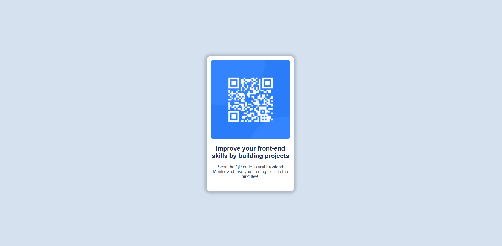

# QR Code Component

This is a simple responsive QR Code card component built using HTML and CSS. It is designed to help improve front-end skills by focusing on layout, styling, and responsiveness.

## 🚀 Demo

