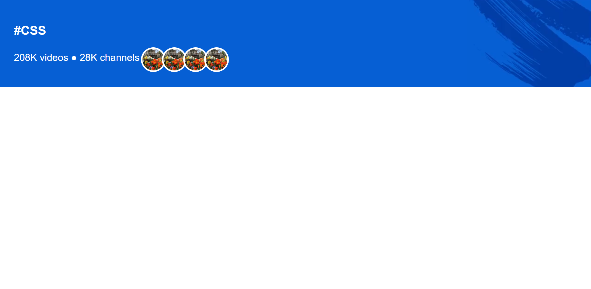

# 🎨 Youtube Header

This is a clean and responsive header section inspired by YouTube's hashtag pages. Built using **HTML** and **CSS**, it demonstrates custom layout, image overlapping, and background styling techniques.

## 🚀 Demo

