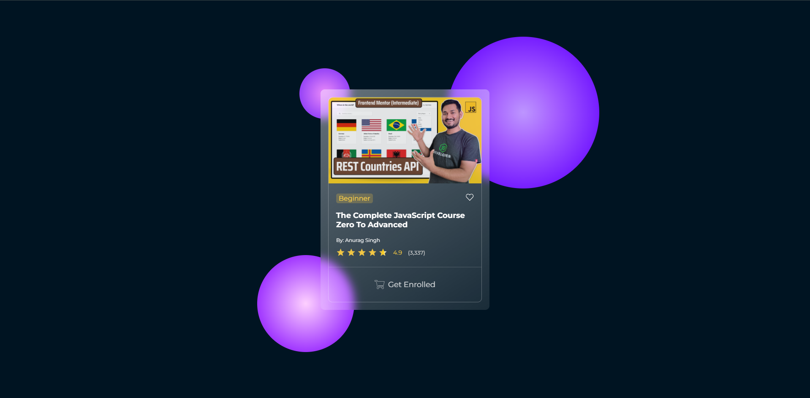

# 🎓 JavaScript Course Card UI (Glassmorphism Style)

A modern, responsive **course card component** styled using **glassmorphism**. Built with HTML and CSS, this component is perfect for showcasing online courses or educational content in a stylish, futuristic interface.

---

## 🖼️ Screenshot

  
