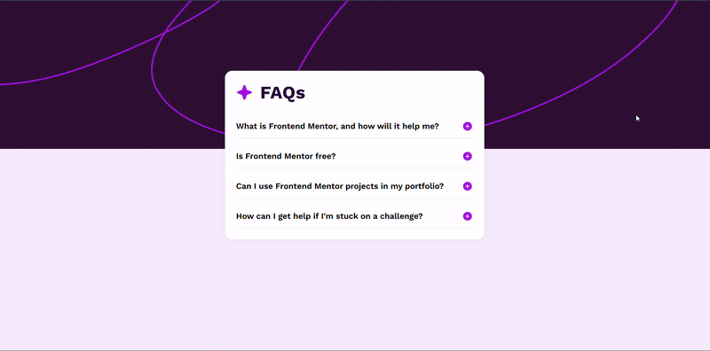

# 🌟 Responsive FAQ Card

A responsive and animated FAQ card built using **HTML** and **CSS**. The card features smooth transitions when expanding or collapsing questions and is fully responsive, adapting beautifully to both desktop and mobile screens.

---

## 🖼️ Screenshot




## 📋 Features

- ✅ Clean and modern design
- 📱 Responsive layout (mobile & desktop)
- 🎯 Smooth accordion-style expand/collapse animations
- 🖼️ SVG icons for visual clarity
- 🅰️ Custom fonts with fallback support

---

## 🚀 Setup Instructions

Follow these steps to run the project locally:

### 1. Clone or Download the Repository

```bash
git clone https://github.com/your-username/faq-card.git
