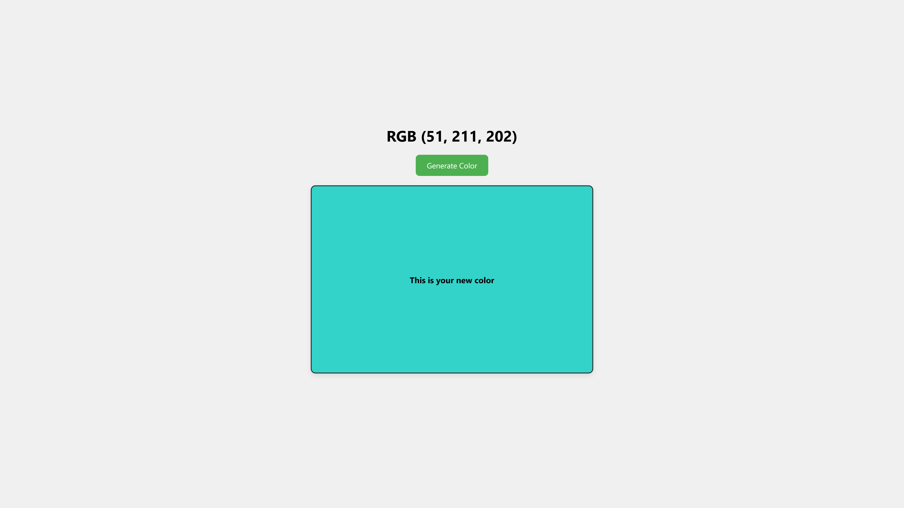

# 🌈 Random Color Generator

A fun and interactive mini web app that generates a **random RGB color** with every click. The background updates instantly, and the color value is displayed — perfect for design inspiration, learning RGB values, or just playing with colors!

---

## 🚀 Live Demo

🔗 **Try It Here**:  https://sudhanshuverse.github.io/frontend-projects/16-random-color-generator/

---

## 📸 Screenshot

---

## ✨ Features

- 🎨 **Random RGB Color Generator** – Each click gives you a new, unique RGB color.
- 🖥️ **Instant Visual Feedback** – Background color changes live with animation.
- 📋 **RGB Code Display** – Know the exact RGB value of the current color.
- 📱 **Fully Responsive** – Works great on desktop and mobile devices.
- 🧼 **Minimal & Modern Design** – Clean layout with smooth transitions.

---

## 🕹️ How to Use

1. **Open the App** – Visit the [Live Demo](https://sudhanshuverse.github.io/frontend-projects/random-color-generator/) or open `index.html` locally.
2. **Click the Button** – Press the `Generate Color` button.
3. **See the Change** – The background of the box changes, and the RGB value appears in the heading.
4. **Repeat** – Keep clicking to discover beautiful random colors!

---

## 📜 Rules / Logic

- Generates **three random numbers** between 0–255.
- Constructs an `rgb(r, g, b)` string from them.
- Updates the UI in real-time with this color.
- The RGB string is also shown on screen for easy copy/reference.

---

## 🛠️ Tech Stack

| Technology   | Role                            |
|--------------|---------------------------------|
| `HTML5`      | Page structure & content        |
| `CSS3`       | Styling, responsiveness, layout |
| `JavaScript` | Logic for random color and DOM manipulation |

---

## 📦 Future Improvements

- 📋 Show HEX value along with RGB
- 📎 Add "Copy to Clipboard" button
- 🧾 Display color history
- 🌈 Generate gradients
- 🌙 Add light/dark theme toggle

---

> _“Colors, like features, follow the changes of the emotions.” – Pablo Picasso_

---

Thanks for visiting! 🎉  
Happy Coloring! 🎨

