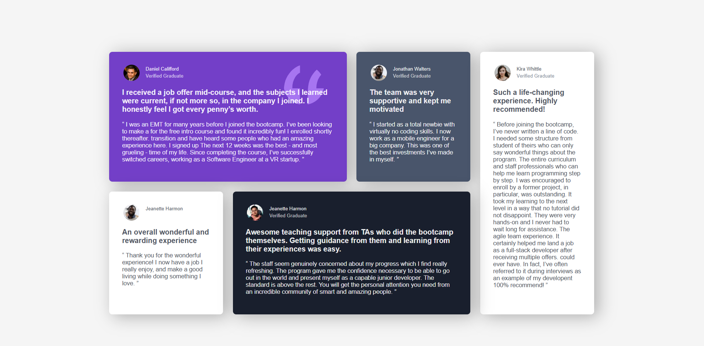

# 💬 Responsive Testimonials Grid

A visually engaging testimonials grid layout built using **HTML** and **CSS Grid**. It adapts beautifully across screen sizes, featuring testimonials from verified graduates with structured and styled components.

## 🖼️ Screenshot

  

## ✨ Features

- ✅ Responsive grid layout (mobile → tablet → desktop)
- ✅ Styled testimonial cards with distinct background colors
- ✅ Reusable structure using utility classes
- ✅ SVG quotation overlay for enhanced design
- ✅ Profile sections with circular avatars and flexible layout

## 🛠️ Built With

- HTML5  
- CSS3 (Grid, Media Queries, Box Shadows, etc.)

## 📱 Responsive Design

| Screen Size | Layout                |
|-------------|------------------------|
| < 600px     | Single column layout   |
| 600px – 999px | Two-column layout     |
| ≥ 1000px    | Four-column layout with card spanning |

---

🚀 *Great for practicing CSS Grid and responsive card design!*
