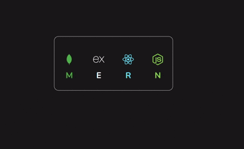

# 🧰 Tooltip UI - MERN Stack Icons

This is a simple and responsive tooltip interface displaying the logos of the **MERN stack**: **MongoDB**, **Express.js**, **React.js**, and **Node.js**. When you hover over each icon, a tooltip appears with the name of the technology.

## 🔧 Features

- Beautiful and clean tooltip animation
- Responsive layout for smaller screens
- Stylized using CSS Flexbox and transitions
- Font: [Google Fonts - Nunito](https://fonts.google.com/specimen/Nunito)
- Custom SVG icons

## 🖼️ Preview

 