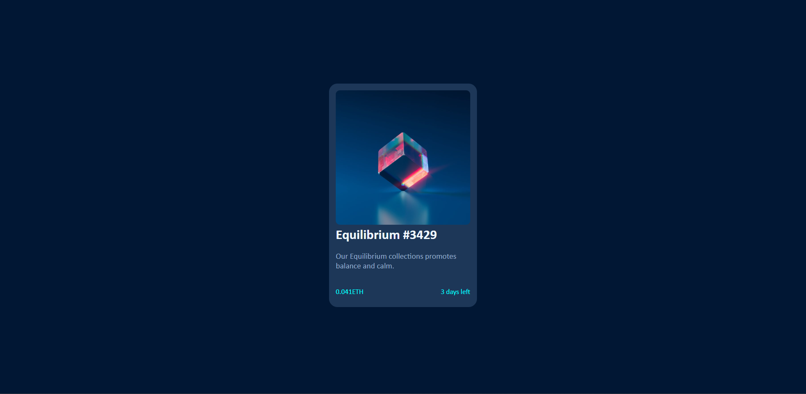
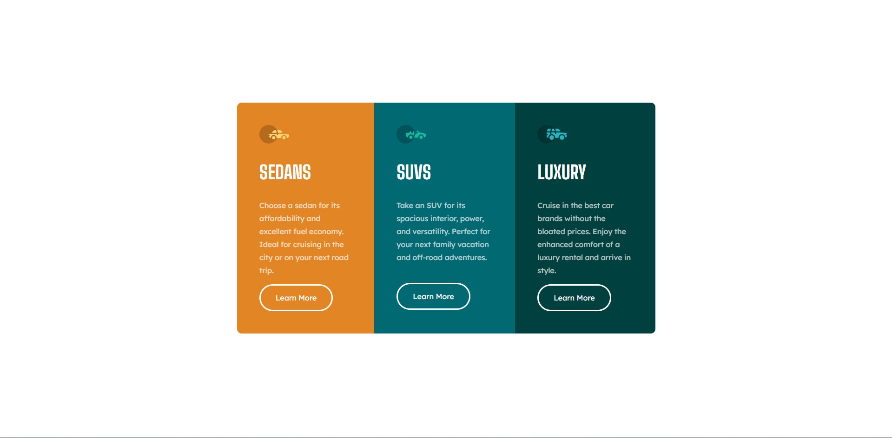
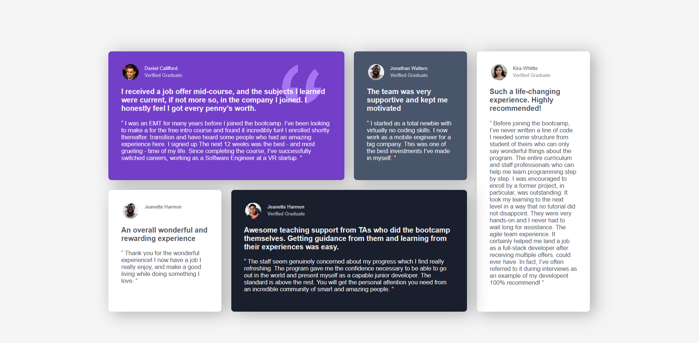
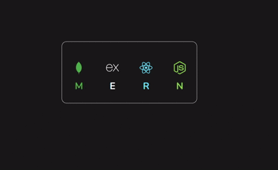
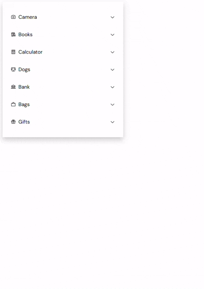

# Frontend Projects 🌟

A curated collection of web development projects to practice **HTML**, **CSS**, and more. Starting with small components like the QR Code Card, this repo will grow with larger projects as I advance in front-end development.

## 📚 About

This repository is my front-end learning portfolio, with all projects organized under the `project/` subfolder (e.g., `1-qr-code-card`). It showcases my progress from simple, responsive designs to future complex web applications.


## 🛠️ Projects

<table>
  <tr>
    <td></td>
  </tr>
  <tr>
    <td></td>
  </tr>
  <tr>
    <td></td>
  </tr>
  <tr>
    <td></td>
  </tr>
  <tr>
    <td></td>
  </tr>
  <tr>
    <td></td>
  </tr>
  <tr>
    <td></td>
  </tr>
  <tr>
    <td></td>
  </tr>
  <tr>
    <td></td>
  </tr>
  <tr>
    <td></td>
  </tr>
</table>

*More projects coming soon!*


## 🚀 Getting Started

1. **Clone**:
   ```bash
   git clone https://github.com/sudhanshuverse/frontend-projects.git

2.  Navigate: cd frontend-projects/project/1-qr-code-card
3.  View: Open index.html in a browser.

```
frontend-projects/
├───
│   ├── 1-qr-code-card/
│   │   ├── index.html         # Main HTML file for the QR code component
│   │   ├── style.css          # Stylesheet for QR code card styling
│   │   ├── image.png          # QR code image used in the project
│   │   ├── screenshot.png     # Screenshot preview of the project
├── README.md                  # Overview of the repository and projects
```

## 🌱 Future Plans
- Add more projects to project/ (e.g., 2-product-card).
- Include larger projects in a future advanced-projects/ folder.
- Host live demos via GitHub Pages.


## 📬 Contact

Feedback welcome! Connect with me:

- **GitHub**: [sudhanshuverse](https://github.com/sudhanshuverse)

Thanks for exploring my projects! 🚀
